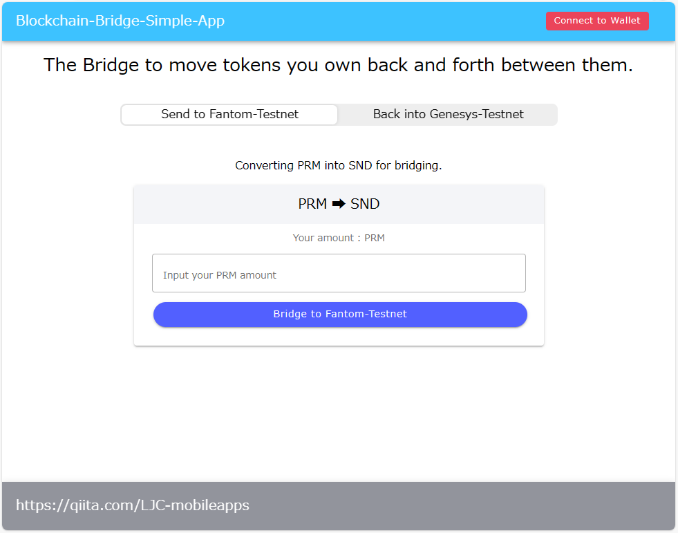

# Blockchain Bridge App Example

Exchange tokens seamlessly between Source token and Dest token using our user-friendly blockchain bridge app.  
This simple application connects tokens from different blockchain networks, providing users with a quick and secure token swapping experience.

## Key Features

* Simple Interface: An intuitive design that allows anyone to exchange tokens effortlessly.
* Swift Transactions: Complete Source token and Dest token transactions in secondarys through the blockchain bridge.
* Emphasis on Security: Employing the latest security protocols to safeguard your assets.
* Transparent Transactions: Real-time tracking of transaction history and status.

## App sources
* Smart contract ( ERC20 based Primary and Secondary Token.)
* Backend java script
* Frontend type script (Ionic Ver7/Angular Ver16)

## How to build and setup.

### 1\. Smart contract  
copy .env.example to .env
```shell
cd contracts
cp .env.example .env
```
modify the values of each directive in the .env file.
```
PARAM_RPC_PRIMARY_ENDPOINT=https://testnet-rpc.primary******
PARAM_RPC_PRIMARY_ENDPOINT_CHAINID=0000
PARAM_RPC_SECONDARY_ENDPOINT=https://testnet-rpc.secondary*****
PARAM_RPC_SECONDARY_ENDPOIN_CHAINID=0000
PARAM_DEPLOY_PRIVATE_KEY=0xXXXXXXXXXXXXXXXXXXXXXXXXXXXXXXXXXXXXXXXXXXXXXXXXXXXXXXXXXXXXXXXX
PARAM_BRIDGE_WALLET_ADDRESS=0xXXXXXXXXXXXXXXXXXXXXXXXXXXXXXXXXXXXXXXXX
```
To obtain tokens for the chain you are deploying to, you can acquire them from a Faucet, especially when deploying to a testnet.  
exp) Fantom Network : https://faucet.fantom.network/

```shell
cd contracts
npm install
npm run deploy:p
npm run deploy:s
```
Once deployed, it is necessary to make a note of the contract addresses for each token.


### 2\. Backend
copy .env.example to .env
```shell
cd backend
cp .env.example .env
```
modify the values of each directive in the .env file.
```
// DO NOT INPUT WSS URL. RPC URL ONLY.
PRIMARY_HTTPS_ENDPOINT=
PRIMARY_TOKEN_CONTRACT_ADDRESS=
// DO NOT INPUT WSS URL. RPC URL ONLY.
SECONDARY_HTTPS_ENDPOINT=
SECONDARY_TOKEN_CONTRACT_ADDRESS=
BRIDGE_WALLET_ADDRESS=
BRIDGE_WALLET_PRIVATE_KEY=
PRIMARY_EXPLORER=https://ropsten.etherscan.io/tx/
SECONDARY_EXPLORER=https://explorer.pops.one/
NONE_ADDR_WALLET=0x0000000000000000000000000000000000000000
```
exp)
Fantom network testnet  
PRIMARY_HTTPS_ENDPOINT : https://rpc.testnet.fantom.network/  

Start a Node Service
```
npm run start
```

### 3\. Frontend  
copy .env.example to .env
```shell
cd frontend
cp .env.example .env
```
modify the values of each directive in the .env file.
```
BB=Blockchain-Bridge-example
BB_PRIMARY_NETWORK_NAME=*******-Testnet
BB_PRIMARY_NETWORK_ID=0xNNNN
BB_PRIMARY_DECIMALS=18
BB_PRIMARY_NETWORK_RPC=https://*******************.network
BB_PRIMARY_NETWORK_BLOCKEXPLORER=https://****************.explorer
BB_SECONDARY_NETWORK_NAME=******-Testnet
BB_SECONDARY_NETWORK_ID=0xNNN
BB_SECONDARY_DECIMALS=18
BB_SECONDARY_NETWORK_RPC=https://rpc.**********************
BB_SECONDARY_NETWORK_BLOCKEXPLORER=https://xxxxxxx.xxxscan.com
BB_PRIMARY_TOKEN_ADDRESS=0xXXXXXXXXXXXXXXXXXXXXXXXXXXXXXXXXXXXXXXXX
BB_PRIMARY_TOKEN_TICKER=XXXXXX
BB_SECONDARY_TOKEN_ADDRESS=0xXXXXXXXXXXXXXXXXXXXXXXXXXXXXXXXXXXXXXXXX
BB_SECONDARY_TOKEN_TICKER=XXXXXX
BB_BRIDGE_WALLET=0xXXXXXXXXXXXXXXXXXXXXXXXXXXXXXXXXXXXXXXXX

```
exp)
Example of Using Fantom Network as the Primary Token.
```
BB_PRIMARY_NETWORK_NAME=Fantom-Testnet  
BB_PRIMARY_NETWORK_ID=0xfa2  
BB_PRIMARY_DECIMALS=18  
BB_PRIMARY_NETWORK_RPC=https://rpc.testnet.fantom.network  
BB_PRIMARY_NETWORK_BLOCKEXPLORER=https://testnet.ftmscan.com
```

Start a Web service.
```
npm run start
```
Open your browser, visit to http://localhost:4200/

#### UI/Screen


## Disclaimer
##### The Bridge feature introduced here is very simple. Please use it as a learning tool application.
